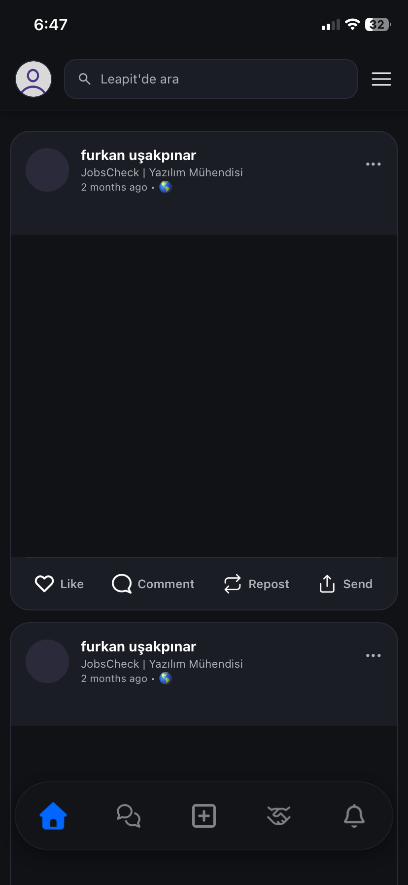
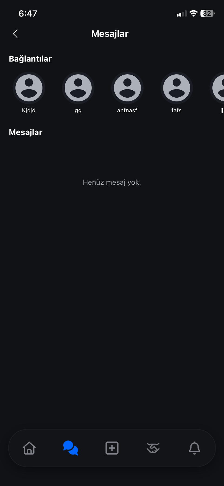
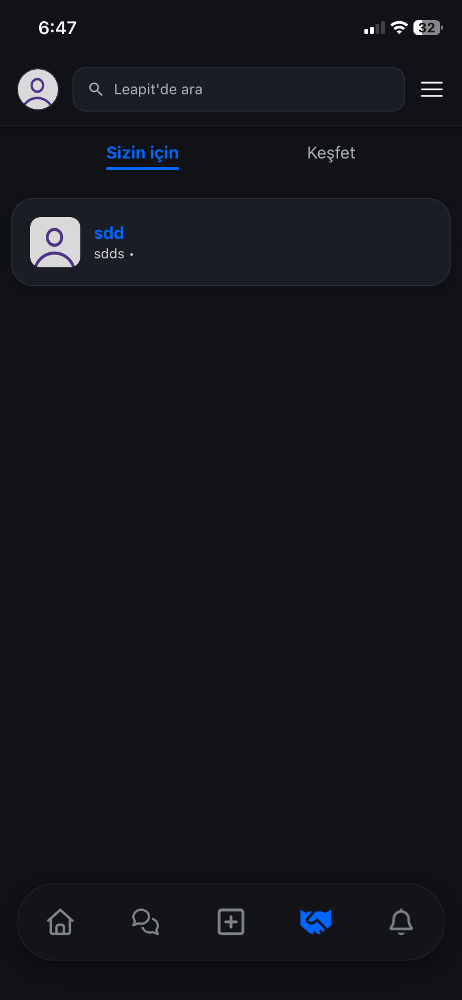
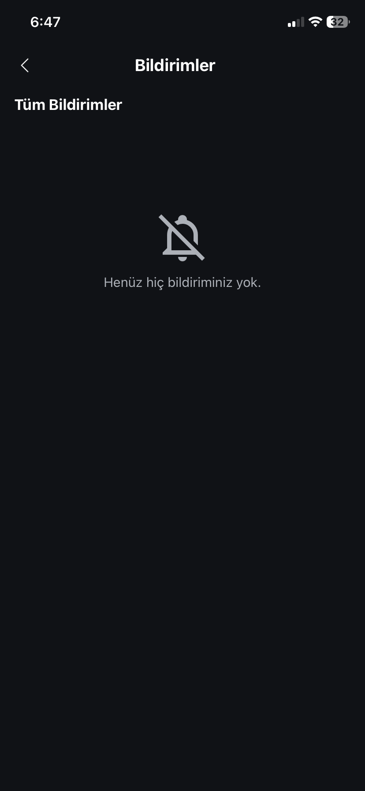
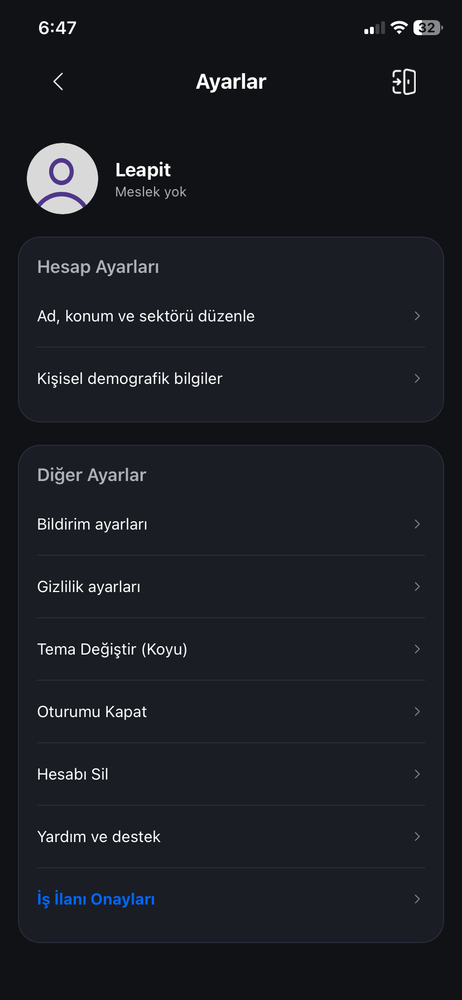
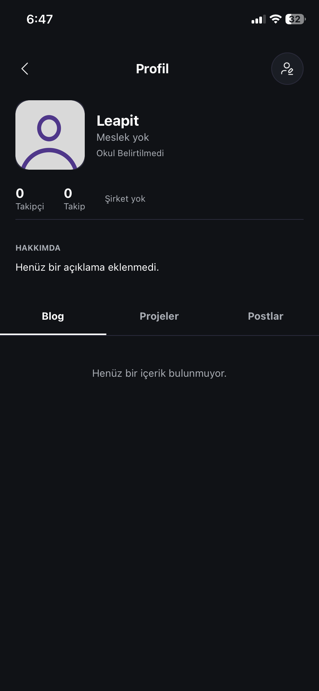

<div align="center">

# Leapit


**A comprehensive career and social networking platform designed for university students and recent graduates.**

<br />

[](https://expo.dev/)
[](https://reactnative.dev/)
[](https://firebase.google.com/)
[](https://redux.js.org/)
[](https://www.typescriptlang.org/)

<br />

Leapit is a modern, feature-rich, and user-friendly job and social networking platform designed for job seekers, companies, and educational institutions. Built with React Native and Expo, this application allows users to apply for job postings, companies to manage candidates, and everyone to build a professional network.

---

## ✨ Core Features

**Job Postings & Management:** Create job listings, review applications, and manage the approval process.

**Multi-Profile Support:** Customized interfaces for Student, Company, and School profiles.

**Social Network:** Connect with other users, share posts, and interact seamlessly.

**Real-Time Messaging:** Instant messaging system powered by Firebase.

**Blog System:** A dedicated space for sharing and reading professional content.

**Notifications:** Instant push notification system for important updates and interactions.

**Dark/Light Mode:** Dynamic theme support based on user preference.

---

## 🛠️ Technology Stack

**Frontend:** React Native, Expo

**State Management:** Redux Toolkit

**Backend & Database:** Firebase (Firestore, Auth)

**Styling:** React Native StyleSheet (Premium Design)

**Others:** EmailJS (For notifications), Cloudinary (Media management)

---

## 📱 Screenshots

<p>
  
  
  
  
</p>
<p>
  
  
  
</p>

---

## 🚀 Getting Started

Follow these steps to run the project in your local environment:

<div align="left">

**1. Clone the repository**
```bash
git clone https://github.com/furkanusakpinar/Leapit.git
